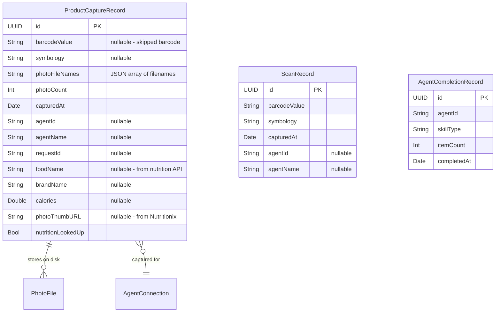

# Agent Demo: Chef — Barcode Scan + Multi-Photo Capture

## Overview

Add a **Chef agent demo** that asks the user to scan a CPG product from their kitchen. Demonstrates a compound capture flow: optional barcode scan → multi-photo capture (front of package, nutrition label) → task completion. This is the first multi-step capture flow in the app and showcases native iOS sensor composition.

**Why this matters for the demo:** Multi-photo capture is a key differentiator. Combined with optional barcode scanning, it shows how Robo makes complex, multi-sensor data capture trivial for AI agents.

## Problem Statement

Current agent requests map 1:1 to a single sensor (barcode OR camera OR LiDAR). Real-world agent tasks often need **multiple data types in sequence**. Additionally, photos from `PhotoCaptureView` are **not persisted** — they vanish on dismiss. The history view cannot show captured photos, and products without barcodes have no storage model.

## Proposed Solution

### Architecture: Compound Capture Flow

Create a new `ProductScanFlowView` that orchestrates a multi-phase capture within a single `.fullScreenCover`:

```
AgentsView → .fullScreenCover(ProductScanFlowView)
                 ├── Phase 1: Barcode scan (skippable)
                 ├── Phase 2: Multi-photo capture (1-3 photos)
                 ├── Phase 3: Review & confirm
                 └── Phase 4: Save + dismiss → sync animation
```

### New SkillType: `.productScan`

Add a compound skill type to `AgentRequest.SkillType` so the dispatch switch in `AgentsView.handleScanNow()` routes to the new flow view.

### New Data Model: V6 Schema

A new `ProductCaptureRecord` in SwiftData (schema V6) that:
- Optionally references a barcode (`barcodeValue: String?`)
- Stores photo file paths (`photoFileNames: [String]` — persisted as JSON string)
- Links to the originating agent (`agentId`, `agentName`)
- Stores basic metadata (timestamp, request ID, photo count)

Photos saved as JPEG files in Application Support directory (persists across launches, not backed up to iCloud).

## Technical Approach

### Phase 1: Data Model (V6 Schema + Photo Persistence)

**File: `ios/Robo/Models/RoboSchema.swift`**

Add `RoboSchemaV6` with new `ProductCaptureRecord` model:

```swift
// New V6 schema
enum RoboSchemaV6: VersionedSchema {
    static var versionIdentifier = Schema.Version(6, 0, 0)
    static var models: [any PersistentModel.Type] {
        [ScanRecord.self, RoomScanRecord.self, MotionRecord.self,
         AgentCompletionRecord.self, ProductCaptureRecord.self]
    }

    @Model
    final class ProductCaptureRecord {
        var id: UUID
        var barcodeValue: String?       // nil if user skipped barcode
        var symbology: String?          // barcode symbology if scanned
        var photoFileNames: String      // JSON array of filenames
        var photoCount: Int
        var capturedAt: Date
        var agentId: String?
        var agentName: String?
        var requestId: String?
        // Nutrition fields (populated async via barcode lookup)
        var foodName: String?
        var brandName: String?
        var calories: Double?
        var photoThumbURL: String?      // from Nutritionix API
        var nutritionLookedUp: Bool

        init(barcodeValue: String? = nil, symbology: String? = nil,
             photoFileNames: [String], agentId: String? = nil,
             agentName: String? = nil, requestId: String? = nil) {
            self.id = UUID()
            self.barcodeValue = barcodeValue
            self.symbology = symbology
            self.photoFileNames = // encode as JSON
            self.photoCount = photoFileNames.count
            self.capturedAt = Date()
            self.agentId = agentId
            self.agentName = agentName
            self.requestId = requestId
            self.nutritionLookedUp = false
        }
    }
}

// Update migration plan: V1 → V2 → V3 → V4 → V5 → V6
// Update typealias: typealias ProductCaptureRecord = RoboSchemaV6.ProductCaptureRecord
// Update RoboApp.swift ModelContainer to reference V6
```

**File: NEW `ios/Robo/Services/PhotoStorageService.swift`**

Handles JPEG file persistence and thumbnail generation:

```swift
enum PhotoStorageService {
    static let photosDir = "ProductPhotos"
    static let thumbsDir = "ProductThumbs"
    static let thumbWidth: CGFloat = 400  // 2x for retina

    /// Save full-res JPEG, return filename
    static func save(_ image: UIImage) -> String?

    /// Generate and save thumbnail, return thumbnail filename
    static func saveThumbnail(_ image: UIImage, filename: String) -> String?

    /// Load image from filename
    static func load(_ filename: String) -> UIImage?

    /// Load thumbnail from filename
    static func loadThumbnail(_ filename: String) -> UIImage?

    /// Delete photos by filenames
    static func delete(_ filenames: [String])
}
```

- Storage location: `Application Support/ProductPhotos/` (full-res) and `Application Support/ProductThumbs/` (thumbnails)
- Naming: `{UUID}.jpg` for uniqueness
- Save photos immediately on capture (JPEG write is fast, prevents data loss on interruption)
- Generate 400px-wide thumbnail at save time (prevents scroll jank in history)

### Phase 2: Compound Flow View

**File: NEW `ios/Robo/Views/ProductScanFlowView.swift`**

Single view managing all phases via internal state machine:

```swift
struct ProductScanFlowView: View {
    let captureContext: CaptureContext?
    @Environment(\.dismiss) private var dismiss
    @Environment(\.modelContext) private var modelContext

    enum FlowPhase {
        case barcodeScan    // Phase 1: scan or skip
        case photoCapture   // Phase 2: take photos
        case review         // Phase 3: review all data
    }

    @State private var phase: FlowPhase = .barcodeScan
    @State private var scannedBarcode: String?        // nil if skipped
    @State private var scannedSymbology: String?
    @State private var capturedPhotos: [(UIImage, String)] = []  // (image, filename)

    var body: some View {
        NavigationStack {
            Group {
                switch phase {
                case .barcodeScan:
                    BarcodeScanPhaseView(
                        onScanned: { code, symbology in
                            scannedBarcode = code
                            scannedSymbology = symbology
                            phase = .photoCapture
                        },
                        onSkip: { phase = .photoCapture }
                    )
                case .photoCapture:
                    PhotoCapturePhaseView(
                        capturedPhotos: $capturedPhotos,
                        onDone: { phase = .review }
                    )
                case .review:
                    ProductReviewView(
                        barcode: scannedBarcode,
                        photos: capturedPhotos,
                        onConfirm: { saveAndDismiss() },
                        onRetakePhotos: { phase = .photoCapture }
                    )
                }
            }
        }
    }

    private func saveAndDismiss() {
        let filenames = capturedPhotos.map { $0.1 }
        let record = ProductCaptureRecord(
            barcodeValue: scannedBarcode,
            symbology: scannedSymbology,
            photoFileNames: filenames,
            agentId: captureContext?.agentId,
            agentName: captureContext?.agentName,
            requestId: captureContext?.requestId.uuidString
        )
        modelContext.insert(record)
        try? modelContext.save()  // Explicit save before dismiss

        // Fire-and-forget nutrition lookup if barcode was scanned
        if let upc = scannedBarcode {
            Task { await NutritionService.lookupForProduct(upc: upc, record: record, ...) }
        }

        dismiss()
    }
}
```

**Key design decisions:**
- **Single `.fullScreenCover`** — no chaining of covers (avoids SwiftUI animation glitches)
- **No back-navigation from photos to barcode** — user must cancel and restart (hackathon simplicity)
- **Photos saved to disk immediately on capture** via `PhotoStorageService` — resilient to interruption
- **SwiftData record created only on final "Done"** — no orphaned records on cancellation

### Phase 3: Barcode Scan Phase (Modified)

**File: `ios/Robo/Views/ProductScanFlowView.swift` (subview)**

A simplified barcode scanner subview (reuses the VisionKit DataScanner) with key differences from standalone `BarcodeScannerView`:

- **Single-scan mode**: Stops scanning after first successful detection (not continuous)
- **Prominent "Skip" button**: Large, visible at bottom — "No barcode? Skip →"
- **Confirmation toast**: Shows scanned code with brief pause before auto-advancing to photos
- **Does NOT create a ScanRecord** — the barcode value is passed to the flow coordinator, not persisted independently
- Falls back to "Camera not available" UI on simulator

### Phase 4: Photo Capture Phase (Modified)

Adapts existing `PhotoCaptureView` patterns with modifications:

- **Checklist guidance**: "Front of package", "Nutrition label" (soft suggestions, not enforced)
- **1-3 photo recommendation**: Subtitle text, not a hard limit
- **Photos saved to disk on capture**: Each shutter press → JPEG write via `PhotoStorageService`
- **Thumbnail strip**: Shows saved photos at bottom of capture screen
- **"Done" requires at least 1 photo**: If 0 photos, show confirmation: "No photos taken. Go back?"
- **Camera permission check**: Mirror `BarcodeScannerView`'s `ContentUnavailableView` pattern for denied/unavailable states

### Phase 5: Review Screen

New view showing summary before final save:

- Product image (first photo, large)
- Barcode value if scanned (or "No barcode" label)
- Photo grid (all captured photos as thumbnails)
- "Retake Photos" button → goes back to photo phase
- "Done" button → saves record + dismisses flow
- Clear, satisfying completion state

### Phase 6: Agent Wiring

**File: `ios/Robo/Models/AgentConnection.swift`**

Add `.productScan` to `SkillType`:

```swift
enum SkillType {
    case lidar
    case barcode
    case camera
    case motion
    case productScan  // NEW: compound barcode + photos
}
```

**File: `ios/Robo/Services/MockAgentService.swift`**

Update the existing "Practical Chef" agent (line 23-32) with a pending request:

```swift
AgentConnection(
    id: UUID(uuidString: "00000000-0000-0000-0000-000000000002")!,
    name: "Practical Chef",
    description: "Analyzes ingredients and nutrition for meal planning",
    iconName: "fork.knife",
    accentColor: .orange,
    status: .connected,
    lastSyncDate: nil,  // No prior sync
    pendingRequest: AgentRequest(
        id: UUID(),
        title: "Scan a product from your kitchen",
        description: "I'd love to analyze a product's ingredients and nutrition. Scan the barcode and snap a few photos of the package.",
        skillType: .productScan,
        photoChecklist: [
            PhotoTask(id: UUID(), label: "Front of package", isCompleted: false),
            PhotoTask(id: UUID(), label: "Nutrition label", isCompleted: false),
        ],
        roomNameHint: nil
    )
)
```

**File: `ios/Robo/Views/AgentsView.swift`**

Add case to `handleScanNow`:

```swift
case .productScan: showingProductScan = true
```

Add new state and `.fullScreenCover`:

```swift
@State private var showingProductScan = false

.fullScreenCover(isPresented: $showingProductScan) {
    ProductScanFlowView(captureContext: selectedCaptureContext)
}
```

Update dismiss handler to detect new `ProductCaptureRecord` entries (same pattern as barcode/LiDAR detection).

### Phase 7: History View Updates

**File: `ios/Robo/Views/ScanHistoryView.swift`**

In "By Agent" mode, add `ProductCaptureRecord` query and display:

```swift
@Query(sort: \ProductCaptureRecord.capturedAt, order: .reverse)
private var productCaptures: [ProductCaptureRecord]
```

Product capture rows show:
- First photo as thumbnail (loaded from `PhotoStorageService.loadThumbnail`)
- Product name (from nutrition lookup) or "Product (date)" fallback
- Barcode value if present, photo count badge
- Tap → new `ProductDetailView`

**File: NEW `ios/Robo/Views/ProductDetailView.swift`**

Detail view for a product capture:
- Photo gallery (scrollable, tap to view full-res)
- Barcode section (if present) with nutrition data
- Agent attribution ("Captured for Practical Chef")
- Timestamp, delete action

### ERD: Data Model Changes



## Implementation Sequence

### Step 1: Data Model (V6 Schema) + Photo Storage
- [x] Add `RoboSchemaV6` with `ProductCaptureRecord`
- [x] Add V5→V6 lightweight migration
- [x] Update `RoboApp.swift` ModelContainer
- [x] Create `PhotoStorageService`
- **Files:** `RoboSchema.swift`, `RoboApp.swift`, NEW `PhotoStorageService.swift`

### Step 2: Compound Flow View
- [x] Create `ProductScanFlowView` with phase state machine
- [x] Barcode scan phase (single-scan mode, skip button)
- [x] Photo capture phase (save to disk on capture, checklist guidance)
- [x] Review phase (photo grid, confirm/retake)
- **Files:** NEW `ProductScanFlowView.swift`

### Step 3: Agent Wiring
- [x] Add `.productScan` to `SkillType`
- [x] Update Chef agent mock data with pending request
- [x] Add dispatch case in `AgentsView.handleScanNow`
- [x] Add `.fullScreenCover` and dismiss handler
- **Files:** `AgentConnection.swift`, `MockAgentService.swift`, `AgentsView.swift`

### Step 4: History View Updates
- [x] Add `ProductCaptureRecord` query to `ScanHistoryView`
- [x] Product rows with photo thumbnails
- [x] Create `ProductDetailView` for full detail
- **Files:** `ScanHistoryView.swift`, NEW `ProductDetailView.swift`

### Step 5: Polish & Demo Prep
- [x] Camera permission check in photo phase
- [ ] Verify nutrition lookup works for demo product
- [ ] Test full flow on physical device
- [ ] Time the demo flow (target: under 3 minutes)

## Edge Cases & Decisions

| Scenario | Decision |
|---|---|
| User takes 0 photos and taps Done | Show confirmation "No photos taken. Go back?" — don't complete task |
| User scans wrong barcode | No back-navigation for MVP; cancel and restart |
| Camera permission denied | Show `ContentUnavailableView` with settings link |
| Nutrition API down | Fire-and-forget; product shows as "Product (date)" in history |
| Multiple barcodes in frame | Single-scan mode stops after first detection |
| App killed mid-flow | Photos already on disk survive; SwiftData record not created (no orphan records). Flow restarts from beginning |
| Product without barcode in history | Shows first photo as identifier, "No barcode" label |
| Storage full | JPEG write fails silently; photo not added to array. User sees fewer photos than expected |

## Demo Rehearsal Checklist

- [ ] Pre-scan demo product barcode to verify Nutritionix returns data for that UPC
- [ ] Physical iPhone charged, camera lens clean
- [ ] Test on actual demo network for latency
- [ ] Time complete flow end-to-end (target < 2 min for capture, 1 min for showing result)
- [ ] Have a known-good product ready (something with clear barcode + nutrition label)
- [ ] Fallback plan: if nutrition API is slow, the flow still completes — photos and barcode are stored

## Files Summary

| File | Action | Description |
|---|---|---|
| `ios/Robo/Models/RoboSchema.swift` | Edit | Add V6 schema with `ProductCaptureRecord` |
| `ios/Robo/RoboApp.swift` | Edit | Update ModelContainer to V6 |
| `ios/Robo/Services/PhotoStorageService.swift` | **Create** | JPEG persistence + thumbnail generation |
| `ios/Robo/Views/ProductScanFlowView.swift` | **Create** | Compound barcode→photos→review flow |
| `ios/Robo/Models/AgentConnection.swift` | Edit | Add `.productScan` SkillType |
| `ios/Robo/Services/MockAgentService.swift` | Edit | Chef agent pending request |
| `ios/Robo/Views/AgentsView.swift` | Edit | Dispatch + dismiss handler for productScan |
| `ios/Robo/Views/ScanHistoryView.swift` | Edit | Show ProductCaptureRecord rows with thumbnails |
| `ios/Robo/Views/ProductDetailView.swift` | **Create** | Product detail with photo gallery |
| `ios/Robo/Services/AgentStore.swift` | Edit | (if needed) Ensure Chef resolves correctly |

## References

- Issue: #95
- Existing barcode scanner: `ios/Robo/Views/BarcodeScannerView.swift`
- Existing photo capture: `ios/Robo/Views/PhotoCaptureView.swift`
- Schema history: `ios/Robo/Models/RoboSchema.swift` (V1→V5)
- Nutrition lookup: `ios/Robo/Services/NutritionService.swift`
- Agent dispatch: `ios/Robo/Views/AgentsView.swift:119-138`
- Learnings: `docs/solutions/architecture-issues/swiftdata-schema-drift-agent-context-threading-20260212.md`
- Learnings: `docs/solutions/database-issues/swiftdata-persistence-failure-no-save-no-schema-versioning-20260210.md`
