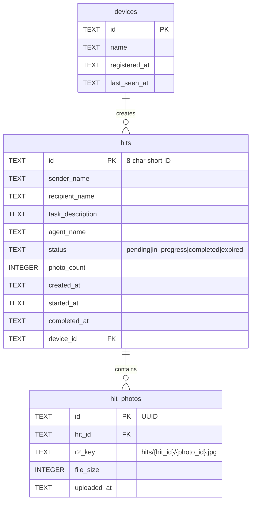

# Functional HIT System — Web Capture, R2 Upload, Chat Interface

## Overview

Transform the static HIT (Human Intelligence Task) demo into a **fully functional system** where:
1. A sender creates a HIT via API/CLI (later via iOS chat interface)
2. System generates a personalized shareable link with dynamic OG preview
3. Recipient opens link → captures photos in-browser → uploads to R2
4. Sender tracks HIT status in the Robo iOS app

This is the **growth engine** for Robo: every HIT link sent to someone who doesn't have the app is a personalized introduction that builds trust through the OG preview card.

## Problem Statement

The static HIT demo (PR #97) proves the concept — personalized OG previews work in iMessage/Slack. But it's hardcoded for one person and the camera button shows "coming soon." To actually demo this at the hackathon, we need:

1. **Dynamic link generation** — Create HITs for any recipient, not just "James"
2. **Working photo capture** — Browser-based multi-photo capture, not a toast message
3. **Photo storage** — Upload captured photos to R2 so the sender can access them
4. **HIT tracking** — See pending/completed HITs in the iOS app
5. **Chat-first UX** — Eventually create HITs through conversation, not forms

## Proposed Solution — Crawl / Walk / Run

### Phase Overview

| Phase | Scope | Goal |
|-------|-------|------|
| **CRAWL** | API + Web capture + R2 upload | Functional demo for hackathon (Feb 16) |
| **WALK** | iOS chat interface + My Data HIT section | Native HIT creation and tracking |
| **RUN** | Dynamic OG images, analytics, multi-task types | Growth engine at scale |

---

## CRAWL — Functional Demo (Target: Feb 16)

### What Ships

1. **D1 `hits` table** — Stores HIT metadata (sender, recipient, task, status, link)
2. **Workers API** — `POST /api/hits` (create), `GET /api/hits/:id` (fetch), `POST /api/hits/:id/upload` (presigned URL), `PATCH /api/hits/:id/complete`
3. **Dynamic HIT web page** — `site/hit/index.html` with JS that fetches HIT data from API and renders personalized content
4. **Browser multi-photo capture** — `getUserMedia` camera with thumbnail strip, review, delete (adapted from coindex pattern)
5. **R2 photo upload** — Presigned URLs generated by Workers, browser uploads directly to R2
6. **CLI/httpie to create HITs** — Always from "M. Silverman" for now

### Technical Approach

#### 1. D1 Schema — New Migration `0002_hits.sql`

```sql
-- workers/migrations/0002_hits.sql

CREATE TABLE hits (
  id TEXT PRIMARY KEY,                    -- 8-char URL-safe short ID
  sender_name TEXT NOT NULL,              -- "M. Silverman"
  recipient_name TEXT NOT NULL,           -- "James"
  task_description TEXT NOT NULL,         -- "Photo the inside of your fridge"
  agent_name TEXT,                        -- "Simple Chef Agent"
  status TEXT NOT NULL DEFAULT 'pending', -- 'pending', 'in_progress', 'completed', 'expired'
  photo_count INTEGER NOT NULL DEFAULT 0, -- number of photos uploaded
  created_at TEXT NOT NULL DEFAULT (datetime('now')),
  started_at TEXT,                        -- when recipient first opened
  completed_at TEXT,                      -- when recipient submitted
  device_id TEXT,                         -- sender's device (nullable for CLI-created)
  FOREIGN KEY (device_id) REFERENCES devices(id)
);

CREATE INDEX idx_hits_status ON hits(status);
CREATE INDEX idx_hits_device ON hits(device_id);

CREATE TABLE hit_photos (
  id TEXT PRIMARY KEY,                    -- UUID
  hit_id TEXT NOT NULL,
  r2_key TEXT NOT NULL,                   -- R2 object key: hits/{hit_id}/{photo_id}.jpg
  file_size INTEGER,                      -- bytes
  uploaded_at TEXT NOT NULL DEFAULT (datetime('now')),
  FOREIGN KEY (hit_id) REFERENCES hits(id)
);

CREATE INDEX idx_hit_photos_hit ON hit_photos(hit_id);
```

#### 2. Workers API Routes — `workers/src/routes/hits.ts`

**Create HIT:**
```typescript
// POST /api/hits
// Body: { recipient_name: string, task_description: string, agent_name?: string }
// Returns: { id, url, sender_name, recipient_name, ... }

const CreateHitSchema = z.object({
  recipient_name: z.string().min(1).max(50),
  task_description: z.string().min(1).max(500),
  agent_name: z.string().max(100).optional(),
});

// Generate 8-char URL-safe ID: base62 from crypto.getRandomValues
function generateShortId(): string {
  const chars = 'ABCDEFGHIJKLMNOPQRSTUVWXYZabcdefghijklmnopqrstuvwxyz0123456789';
  const bytes = new Uint8Array(8);
  crypto.getRandomValues(bytes);
  return Array.from(bytes, b => chars[b % chars.length]).join('');
}
```

**Get HIT (public — no auth):**
```typescript
// GET /api/hits/:id
// Returns: { id, sender_name, recipient_name, task_description, agent_name, status, photo_count }
// NOTE: No auth required — this powers the public HIT landing page
```

**Request presigned upload URL:**
```typescript
// POST /api/hits/:id/upload
// Returns: { photo_id, upload_url, r2_key }
// Uses aws4fetch to generate presigned PUT URL for R2
// R2 key: hits/{hit_id}/{photo_id}.jpg
```

**Complete HIT:**
```typescript
// PATCH /api/hits/:id/complete
// Updates status to 'completed', sets completed_at
// Returns: { id, status, photo_count, completed_at }
```

**List HITs (for sender — auth required):**
```typescript
// GET /api/hits
// Requires X-Device-ID header
// Returns: { hits: [...], count: number }
```

**Dependencies:**
- Add `aws4fetch` to `package.json` for presigned URL generation
- Add R2 S3 API credentials as Workers secrets:
  - `R2_ACCESS_KEY_ID`
  - `R2_SECRET_ACCESS_KEY`
- CORS on R2 bucket for browser uploads

#### 3. R2 Presigned URL Pattern

Using `aws4fetch` (Workers-compatible, no Node.js deps):

```typescript
import { AwsClient } from 'aws4fetch';

async function generatePresignedUrl(
  env: Env,
  r2Key: string,
  expiresIn: number = 3600
): Promise<string> {
  const client = new AwsClient({
    accessKeyId: env.R2_ACCESS_KEY_ID,
    secretAccessKey: env.R2_SECRET_ACCESS_KEY,
  });

  const url = new URL(
    `https://${env.CLOUDFLARE_ACCOUNT_ID}.r2.cloudflarestorage.com/robo-data/${r2Key}`
  );
  url.searchParams.set('X-Amz-Expires', expiresIn.toString());

  const signed = await client.sign(
    new Request(url, { method: 'PUT' }),
    { aws: { signQuery: true } }
  );

  return signed.url;
}
```

**R2 CORS configuration** (required for browser uploads):
```json
{
  "rules": [{
    "allowed": {
      "origins": ["https://robo.app", "http://localhost:*"],
      "methods": ["PUT", "HEAD"],
      "headers": ["Content-Type"]
    },
    "maxAgeSeconds": 3600
  }]
}
```

#### 4. Dynamic HIT Web Page — `site/hit/index.html`

A single HTML page that:
1. Extracts HIT ID from URL path (`/hit/abc12345`)
2. Fetches HIT data from `GET /api/hits/:id`
3. Renders personalized greeting, task card, and CTA
4. On camera tap → opens multi-photo capture flow
5. Uploads photos to R2 via presigned URLs
6. Shows completion confirmation

**Routing:** Cloudflare Pages uses file-based routing. For clean URLs like `/hit/abc12345`, we need a `_redirects` file or a Pages Function. Simplest approach for CRAWL: use query param `/hit/?id=abc12345` or a single `site/hit/index.html` that reads the path segment via JS.

**Alternative (cleaner):** Add a Pages Function at `site/functions/hit/[id].ts` that serves the HTML with the HIT ID injected. This gives us `/hit/abc12345` URLs naturally.

```
site/
├── functions/
│   └── hit/
│       └── [id].ts        # Pages Function — serves HIT page + injects OG tags
├── hit/
│   ├── capture.js         # Multi-photo capture module
│   └── styles.css         # HIT page styles (or inline)
├── demo/hit/              # Keep existing static demo
└── index.html             # Main landing page
```

**Pages Function** (`site/functions/hit/[id].ts`):
```typescript
// Fetches HIT data from Workers API
// Returns full HTML with personalized OG tags
// This is critical for link previews — crawlers don't execute JS

export const onRequest: PagesFunction = async (context) => {
  const hitId = context.params.id as string;

  // Fetch HIT data from Workers API
  const hit = await fetch(`https://robo-api.silv.workers.dev/api/hits/${hitId}`);
  const data = await hit.json();

  // Return HTML with personalized OG meta tags + JS app
  return new Response(renderHitPage(data), {
    headers: { 'Content-Type': 'text/html' },
  });
};
```

This solves the critical problem: **OG crawlers (iMessage, Slack) don't execute JavaScript**, so the OG tags must be in the initial HTML response. A Pages Function can inject them server-side.

#### 5. Browser Multi-Photo Capture

Adapted from coindex's `MultiCaptureCamera` pattern but simplified for vanilla JS:

```javascript
// site/hit/capture.js — Browser multi-photo capture

class HitCapture {
  constructor(hitId) {
    this.hitId = hitId;
    this.photos = [];       // { id, blob, thumbnailUrl }
    this.stream = null;
    this.maxPhotos = 10;
  }

  async startCamera() {
    this.stream = await navigator.mediaDevices.getUserMedia({
      video: { facingMode: 'environment', width: { ideal: 1920 }, height: { ideal: 1080 } }
    });
    // Attach to <video> element
  }

  capturePhoto() {
    // Canvas-based capture from video stream
    // Add to this.photos array
    // Show thumbnail in strip
  }

  removePhoto(index) {
    URL.revokeObjectURL(this.photos[index].thumbnailUrl);
    this.photos.splice(index, 1);
  }

  async uploadAll() {
    for (const photo of this.photos) {
      // 1. Request presigned URL from API
      const { upload_url } = await fetch(`/api/hits/${this.hitId}/upload`).then(r => r.json());
      // 2. PUT photo blob to R2
      await fetch(upload_url, { method: 'PUT', body: photo.blob });
    }
    // 3. Complete the HIT
    await fetch(`/api/hits/${this.hitId}/complete`, { method: 'PATCH' });
  }
}
```

**Key UX elements (from coindex reference):**
- Full-screen dark camera view
- Large circular shutter button (80px)
- Horizontal thumbnail strip at bottom (auto-scroll)
- Remove button (red X) on each thumbnail
- Photo count indicator
- "Done" / "Submit" button with count badge
- Flip camera toggle
- Permission denied state handling

**Browser compatibility:**
- `getUserMedia` is supported in iOS Safari 14.3+, Chrome Android, all modern browsers
- `facingMode: 'environment'` for back camera by default
- Canvas `toBlob('image/jpeg', 0.85)` for JPEG compression
- `URL.createObjectURL` for thumbnail previews

#### 6. CLI HIT Creation

For the demo, create HITs via httpie:

```bash
# Create a HIT
http POST https://robo-api.silv.workers.dev/api/hits \
  recipient_name="James" \
  task_description="Photo the inside of your fridge" \
  agent_name="Simple Chef Agent" \
  --timeout=10

# Response:
# {
#   "id": "xK9mP2qR",
#   "url": "https://robo.app/hit/xK9mP2qR",
#   "sender_name": "M. Silverman",
#   "recipient_name": "James",
#   "status": "pending"
# }

# Check HIT status
http GET https://robo-api.silv.workers.dev/api/hits/xK9mP2qR --timeout=10
```

### CRAWL Acceptance Criteria

- [ ] `POST /api/hits` creates a HIT with short ID and returns shareable URL
- [ ] `GET /api/hits/:id` returns HIT data (public, no auth)
- [ ] `POST /api/hits/:id/upload` returns presigned R2 URL
- [ ] `PATCH /api/hits/:id/complete` marks HIT as completed
- [ ] HIT web page shows personalized greeting from API data (not hardcoded)
- [ ] OG meta tags are server-rendered in Pages Function (works in iMessage/Slack)
- [ ] Browser camera opens and captures photos
- [ ] Photos upload to R2 via presigned URLs
- [ ] Thumbnail strip shows captured photos with delete option
- [ ] Submit button uploads all photos and shows completion screen
- [ ] Works on iOS Safari (primary) and Chrome Android
- [ ] HIT URL can be sent in iMessage and shows personalized card

### CRAWL File List

```
workers/
├── migrations/
│   └── 0002_hits.sql                # New D1 tables
├── src/
│   ├── routes/hits.ts               # HIT CRUD + presigned upload
│   ├── types.ts                     # Add HIT schemas + Env update
│   └── index.ts                     # Register /api/hits/* routes
├── package.json                     # Add aws4fetch dependency
└── wrangler.toml                    # Add R2 S3 API secrets reference

site/
├── functions/
│   └── hit/
│       └── [id].ts                  # Pages Function for dynamic OG + HTML
├── hit/
│   ├── capture.js                   # Multi-photo capture module
│   └── app.js                       # HIT page app logic (fetch, render, upload)
└── _headers                         # Cache headers if needed
```

---

## WALK — iOS Chat Interface + My Data

### What Ships

1. **iOS chat interface** — Native SwiftUI chat view using [ExyteChat](https://github.com/exyte/Chat) library
2. **HIT creation via chat** — "Create a task for James: photo your fridge" → generates link
3. **My Data: HITs section** — Browse pending/completed HITs, copy link, view photos
4. **Push/poll for HIT completion** — Show when a HIT is completed

### Technical Approach

#### 1. Chat Interface — ExyteChat Integration

[ExyteChat](https://github.com/exyte/Chat) is a SwiftUI-native chat framework with:
- Fully customizable message cells
- Built-in media picker
- MIT licensed
- Active maintenance (latest commits 2025)

```swift
// ios/Robo/Views/ChatView.swift
import ExyteChat

struct RoboChatView: View {
    @State private var messages: [Message] = []

    var body: some View {
        ChatView(messages: messages) { draft in
            // Process user message
            // If it mentions creating a task → call POST /api/hits
            // Show HIT link as a rich message bubble
        }
        .chatTheme(.robo) // Custom dark theme matching app
    }
}
```

**Chat flow for HIT creation:**
1. User: "Create a task for James"
2. Robo: "What should James do?"
3. User: "Photo the inside of his fridge"
4. Robo: "Which agent is this for?" (optional, show picker)
5. User: "Simple Chef"
6. Robo: "Got it! Here's the link for James:" → shows rich card with copy button

#### 2. My Data: HIT Section

Extend `ScanHistoryView` with a new section:

```swift
// ios/Robo/Views/HITListView.swift
struct HITListView: View {
    @State private var hits: [HIT] = []

    var body: some View {
        List(hits) { hit in
            HITRowView(hit: hit)
        }
        .task { await loadHITs() }
    }
}

struct HITRowView: View {
    let hit: HIT

    var body: some View {
        HStack {
            VStack(alignment: .leading) {
                Text(hit.recipientName)
                    .font(.headline)
                Text(hit.taskDescription)
                    .font(.caption)
                    .foregroundStyle(.secondary)
            }
            Spacer()
            StatusBadge(status: hit.status)
        }
        .contextMenu {
            Button("Copy Link") { /* clipboard */ }
        }
    }
}
```

#### 3. HIT Data Model

```swift
// ios/Robo/Models/HIT.swift
struct HIT: Codable, Identifiable {
    let id: String
    let senderName: String
    let recipientName: String
    let taskDescription: String
    let agentName: String?
    let status: HITStatus
    let photoCount: Int
    let createdAt: Date
    let completedAt: Date?

    var url: URL {
        URL(string: "https://robo.app/hit/\(id)")!
    }
}

enum HITStatus: String, Codable {
    case pending, inProgress = "in_progress", completed, expired
}
```

### WALK Acceptance Criteria

- [ ] Chat view accessible from a new tab or entry point
- [ ] Natural language HIT creation works ("create a task for [name]")
- [ ] Chat shows HIT link as a rich card with copy-to-clipboard
- [ ] My Data shows HITs section with pending/completed list
- [ ] HIT rows show recipient name, task, status badge, timestamp
- [ ] Pull-to-refresh updates HIT status from API
- [ ] Tapping a HIT row shows detail view with photos (if completed)

### WALK Dependencies

- [ ] SPM package: `https://github.com/exyte/Chat` (ExyteChat)
- [ ] CRAWL phase complete (API endpoints functional)
- [ ] API endpoint: `GET /api/hits` (list sender's HITs)

---

## RUN — Dynamic OG Images, Scale, Analytics

### What Ships

1. **Dynamic OG image generation** — `workers-og` (satori + resvg-wasm) generates personalized 1200x630 PNGs
2. **Three-tier OG caching** — Cache API (edge) → R2 (durable) → Generate (CPU-intensive)
3. **`hit.robo.app` subdomain** — Clean URL routing via Workers custom domain
4. **HIT expiration** — Auto-expire after 7 days, cron trigger cleanup
5. **Analytics** — Track link opens, capture starts, completions (funnel metrics)
6. **Multi-task types** — Not just photos: LiDAR scans, barcode scans, etc.

### Technical Approach

#### 1. Dynamic OG with `workers-og`

```typescript
// workers/src/routes/og.ts
import { ImageResponse } from 'workers-og';

export async function generateOGImage(c: Context<{ Bindings: Env }>) {
  const hitId = c.req.param('id');
  const hit = await getHit(c.env.DB, hitId);

  // Check R2 cache first
  const cached = await c.env.BUCKET.get(`og/${hitId}.png`);
  if (cached) return new Response(cached.body, { headers: { 'Content-Type': 'image/png' } });

  // Generate with workers-og
  const image = new ImageResponse(
    `<div style="display:flex;flex-direction:column;align-items:center;justify-content:center;
      width:1200px;height:630px;background:#06060a;color:white;font-family:sans-serif">
      <div style="font-size:96px;font-weight:700">Hi ${hit.recipient_name},</div>
      <div style="font-size:42px;color:#6b6b7b">${hit.sender_name} assigned you a task</div>
      <div style="margin-top:36px;padding:14px 36px;border:1px solid rgba(37,99,235,0.25);border-radius:100px">
        <span style="font-size:24px;font-weight:700">${hit.task_description}</span>
      </div>
    </div>`,
    { width: 1200, height: 630 }
  );

  // Cache to R2
  await c.env.BUCKET.put(`og/${hitId}.png`, image.clone().body);

  return image;
}
```

**Serve at:** `GET /api/hits/:id/og.png` — referenced by `og:image` meta tag

#### 2. `hit.robo.app` Subdomain

```toml
# workers/wrangler.toml (addition)
[[routes]]
pattern = "hit.robo.app/*"
custom_domain = true
```

URLs become: `hit.robo.app/xK9mP2qR` instead of `robo.app/hit/xK9mP2qR`

#### 3. HIT Expiration Cron

```toml
# workers/wrangler.toml
[triggers]
crons = ["0 0 * * *"]  # Daily at midnight UTC
```

```typescript
export default {
  async scheduled(event, env, ctx) {
    // Expire HITs older than 7 days that are still pending
    await env.DB.prepare(
      "UPDATE hits SET status = 'expired' WHERE status = 'pending' AND created_at < datetime('now', '-7 days')"
    ).run();
  }
};
```

### RUN Acceptance Criteria

- [ ] OG images generate dynamically per-HIT with recipient name
- [ ] OG images cached in R2 after first generation
- [ ] `hit.robo.app` subdomain routes to Workers
- [ ] Expired HITs show "This task has expired" page
- [ ] Analytics track: link opens, capture starts, photo uploads, completions
- [ ] Multiple task types supported (photo, LiDAR, barcode)

---

## Data Model (ERD)



## Alternative Approaches Considered

### 1. Direct R2 Upload (via Workers proxy) vs Presigned URLs
- **Presigned URLs (chosen):** Browser uploads directly to R2, no Workers CPU cost for file transfer. Proven pattern from coindex.
- **Workers proxy:** Simpler code but Workers has 100MB request limit and CPU time limits. Photos could be large.

### 2. Pages Function vs Workers for HIT page serving
- **Pages Function (chosen for CRAWL):** Co-located with static site, simpler deployment, file-based routing.
- **Separate Worker:** More flexible but adds deployment complexity. Better for RUN phase with `hit.robo.app`.

### 3. ExyteChat vs Custom Chat UI
- **ExyteChat (chosen):** Production-ready SwiftUI chat framework, MIT licensed, saves weeks of work.
- **Custom:** Full control but massive effort for a hackathon. Not worth it.

### 4. Static OG Images vs Dynamic Generation
- **Static for CRAWL:** The Pages Function can use a pre-generated template with text overlay. No `workers-og` dependency needed yet.
- **Dynamic for RUN:** `workers-og` with R2 caching. Requires paid Workers plan ($5/mo) for CPU time.

## Dependencies & Risks

| Risk | Mitigation |
|------|-----------|
| R2 presigned URLs require S3 API credentials | Generate R2 API token in Cloudflare dashboard, add as Workers secrets |
| `getUserMedia` may fail on older iOS Safari | Show fallback file picker (`<input type="file" accept="image/*" capture="environment">`) |
| Pages Functions + Workers API CORS | Same-origin if both on robo.app; cross-origin needs proper CORS headers |
| Workers CPU time for OG generation (RUN) | Three-tier caching; paid plan if needed |
| ExyteChat compatibility with iOS 17 | Library targets iOS 16+, should be fine |
| Hackathon deadline pressure | CRAWL scope is deliberately minimal — functional but not polished |

## Security Considerations

- **HIT IDs are unguessable** — 8-char base62 = 218 trillion combinations
- **Presigned URLs expire** — 1-hour TTL, PUT-only (no read access)
- **No PII in URLs** — Only short ID, names are in the API response
- **Rate limiting** — Add basic rate limiting on `POST /api/hits` (10/minute per IP)
- **File type validation** — Presigned URLs should restrict Content-Type to `image/jpeg`, `image/png`
- **Max file size** — R2 presigned URL can enforce max content length

## References

### Internal
- Static HIT demo: `site/demo/hit/index.html` (PR #97)
- Existing HIT plan: `docs/plans/2026-02-12-feat-hit-link-personalized-og-preview-plan.md`
- Workers backend: `workers/src/index.ts`
- D1 schema: `workers/migrations/0001_initial_schema.sql`
- R2 usage pattern: `workers/src/routes/debug.ts`
- Photo capture pattern: coindex-monorepo `MultiCaptureCamera.tsx`, `useMultiCapture.ts`

### External
- [R2 Presigned URLs docs](https://developers.cloudflare.com/r2/api/s3/presigned-urls/)
- [aws4fetch — Workers-compatible S3 signing](https://github.com/mhart/aws4fetch)
- [Hono + R2 presigned URLs guide](https://lirantal.com/blog/cloudflare-r2-presigned-url-uploads-hono)
- [workers-og — Edge OG image generation](https://github.com/kvnang/workers-og)
- [Cloudflare dynamic OG tutorial](https://developers.cloudflare.com/workers/tutorials/generate-dynamic-og-images-using-workers/)
- [ExyteChat — SwiftUI chat framework](https://github.com/exyte/Chat)
- [R2 Workers API usage](https://developers.cloudflare.com/r2/api/workers/workers-api-usage/)
